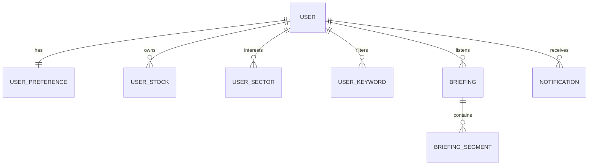

# Kom-Cast 백엔드 도메인(Entity) 설계서

NCP PostgreSQL 데이터베이스 설계를 기반으로 하는 도메인 모델 정의서입니다. 
각 Entity는 해커톤의 기민한 구현을 위해 CamelCase 필드 명을 가지며, JPA를 통해 PostgreSQL의 snake_case 컬럼으로 자동 매핑될 수 있도록 설계되었습니다.

---

## 📂 ERD 개념적 관계도

---

## 🏛️ Entity 상세 테이블 정의

### 1) User (사용자)
- **설명**: 회원가입/인증 기능은 제외되었으나, 모든 온보딩 설정 및 브리핑 내역을 사용자 식별하기 위한 기본 모델입니다.
- **클래스명**: `com.komcast.be.domain.User`

| 논리명 | 물리명(컬럼명) | Java 타입 | DB 타입 | 제약조건 | 비고 |
| :--- | :--- | :--- | :--- | :--- | :--- |
| 사용자 ID | `id` | `Long` | `bigint` | PK, Auto Increment | |
| 닉네임 | `nickname` | `String` | `varchar(50)` | Nullable | 기본값: `'민준'` |
| 구독 플랜 | `plan` | `String` | `varchar(20)` | Not Null | `FREE`, `PREMIUM` (기본값: `FREE`) |
| 가입일시 | `created_at` | `LocalDateTime` | `timestamp` | Not Null | |
| 수정일시 | `updated_at` | `LocalDateTime` | `timestamp` | Not Null | |

---

### 2) UserPreference (개인화 및 온보딩 설정)
- **설명**: 사용자가 온보딩 및 설정 화면에서 등록한 데일리 브리핑 환경설정입니다. **개인별 발송 시각 커스텀 기능은 데이터 수집 및 TTS 생성 효율을 위해 제외**되었습니다. User와 1:1 관계입니다.
- **클래스명**: `com.komcast.be.domain.UserPreference`

| 논리명 | 물리명(컬럼명) | Java 타입 | DB 타입 | 제약조건 | 비고 |
| :--- | :--- | :--- | :--- | :--- | :--- |
| 설정 ID | `id` | `Long` | `bigint` | PK, Auto Increment | |
| 사용자 ID | `user_id` | `Long` | `bigint` | FK, Unique | User 테이블 참조 |
| 브리핑 길이 | `briefing_duration` | `Integer` | `integer` | Not Null | 분 단위 (예: `5`, `10`, `15`) |
| 성우 목소리 ID | `voice` | `String` | `varchar(30)` | Not Null | `junhyuk`, `sunghoon`, `jieun`, `suyeon` |
| 커스텀 요구 | `free_text` | `String` | `text` | Nullable | AI 브리핑 참고 텍스트 |
| 브리핑 알림 ON | `notify_briefing` | `Boolean` | `boolean` | Not Null | 기본값: `true` |
| 가격 변동 알림 ON | `notify_price_alert` | `Boolean` | `boolean` | Not Null | 기본값: `true` |
| 마케팅 알림 ON | `notify_marketing` | `Boolean` | `boolean` | Not Null | 기본값: `false` |

---

### 3) UserStock (관심/보유 종목)
- **설명**: 사용자가 등록한 보유/관심 종목입니다. User와 N:1 관계입니다.
- **클래스명**: `com.komcast.be.domain.UserStock`

| 논리명 | 물리명(컬럼명) | Java 타입 | DB 타입 | 제약조건 | 비고 |
| :--- | :--- | :--- | :--- | :--- | :--- |
| 종목 설정 ID | `id` | `Long` | `bigint` | PK, Auto Increment | |
| 사용자 ID | `user_id` | `Long` | `bigint` | FK | User 테이블 참조 |
| 종목 코드 | `stock_code` | `String` | `varchar(10)` | Not Null | 예: `005930` |
| 종목 구분 | `type` | `String` | `varchar(20)` | Not Null | `PORTFOLIO` (보유), `INTEREST` (일반 관심) |

---

### 4) UserSector (관심 산업 분야)
- **설명**: 온보딩 시 선택한 관심 산업 카테고리 정보입니다.
- **클래스명**: `com.komcast.be.domain.UserSector`

| 논리명 | 물리명(컬럼명) | Java 타입 | DB 타입 | 제약조건 | 비고 |
| :--- | :--- | :--- | :--- | :--- | :--- |
| 관심 섹터 ID | `id` | `Long` | `bigint` | PK, Auto Increment | |
| 사용자 ID | `user_id` | `Long` | `bigint` | FK | User 테이블 참조 |
| 섹터 명칭 | `sector_name` | `String` | `varchar(50)` | Not Null | 예: `반도체`, `2차전지`, `금융` 등 |

---

### 5) UserKeyword (필터 키워드)
- **설명**: 브리핑 대본 생성 시 반드시 포함하거나 제외할 커스텀 키워드입니다.
- **클래스명**: `com.komcast.be.domain.UserKeyword`

| 논리명 | 물리명(컬럼명) | Java 타입 | DB 타입 | 제약조건 | 비고 |
| :--- | :--- | :--- | :--- | :--- | :--- |
| 키워드 ID | `id` | `Long` | `bigint` | PK, Auto Increment | |
| 사용자 ID | `user_id` | `Long` | `bigint` | FK | User 테이블 참조 |
| 키워드 텍스트 | `keyword` | `String` | `varchar(50)` | Not Null | 예: `실적`, `인수합병` |
| 키워드 구분 | `type` | `String` | `varchar(20)` | Not Null | `INCLUDE` (포함), `EXCLUDE` (제외) |

---

### 6) Briefing (생성된 AI 브리핑)
- **설명**: AI Server에 의해 NCP Object Storage에 적재되고, 사용자별로 발급되는 일별 브리핑 메타데이터 파일입니다.
- **클래스명**: `com.komcast.be.domain.Briefing`

| 논리명 | 물리명(컬럼명) | Java 타입 | DB 타입 | 제약조건 | 비고 |
| :--- | :--- | :--- | :--- | :--- | :--- |
| 브리핑 ID | `id` | `Long` | `bigint` | PK, Auto Increment | |
| 사용자 ID | `user_id` | `Long` | `bigint` | FK | User 테이블 참조 |
| 브리핑 일자 | `date` | `LocalDate` | `date` | Not Null | |
| 헤드라인 타이틀 | `headline` | `String` | `varchar(255)` | Not Null | 예: `"삼성전자·SK하이닉스 실적 서프라이즈"` |
| 오디오 파일 경로 | `audio_url` | `String` | `varchar(512)` | Not Null | NCP Object Storage 내 객체 주소 |
| 총 재생 시간 | `duration_seconds`| `Integer` | `integer` | Not Null | 초 단위 (예: `600`) |
| 생성일시 | `created_at` | `LocalDateTime` | `timestamp` | Not Null | |

---

### 7) BriefingSegment (브리핑 대본 구간)
- **설명**: 오디오 재생 싱크와 함께 프론트엔드 화면에 노출될 대본 구간입니다. Briefing과 N:1 관계입니다.
- **클래스명**: `com.komcast.be.domain.BriefingSegment`

| 논리명 | 물리명(컬럼명) | Java 타입 | DB 타입 | 제약조건 | 비고 |
| :--- | :--- | :--- | :--- | :--- | :--- |
| 세그먼트 ID | `id` | `Long` | `bigint` | PK, Auto Increment | |
| 브리핑 ID | `briefing_id` | `Long` | `bigint` | FK | Briefing 테이블 참조 |
| 재생 시점 비율 | `fraction` | `Double` | `double precision`| Not Null | 오디오 내 시간 비율 (0.0 ~ 1.0) |
| 타겟 종목/분야 | `stock_name` | `String` | `varchar(50)` | Not Null | 해당 구간의 메인 종목명/분야 |
| 대본 텍스트 | `text` | `String` | `text` | Not Null | 실제 TTS로 변환된 전체 텍스트 내용 |

---

### 8) Notification (알림 내역)
- **설명**: 사용자에게 전송된 실시간/스케줄 알림 히스토리입니다.
- **클래스명**: `com.komcast.be.domain.Notification`

| 논리명 | 물리명(컬럼명) | Java 타입 | DB 타입 | 제약조건 | 비고 |
| :--- | :--- | :--- | :--- | :--- | :--- |
| 알림 ID | `id` | `Long` | `bigint` | PK, Auto Increment | |
| 사용자 ID | `user_id` | `Long` | `bigint` | FK | User 테이블 참조 |
| 알림 분류 | `type` | `String` | `varchar(30)` | Not Null | `BRIEFING`, `STOCK_ALERT`, `VOICE_UPDATE` |
| 알림 제목 | `title` | `String` | `varchar(255)` | Not Null | |
| 알림 상세 내용 | `description` | `String` | `text` | Not Null | |
| 읽음 상태 | `is_read` | `Boolean` | `boolean` | Not Null | 기본값: `false` |
| 생성시간 | `created_at` | `LocalDateTime` | `timestamp` | Not Null | |
